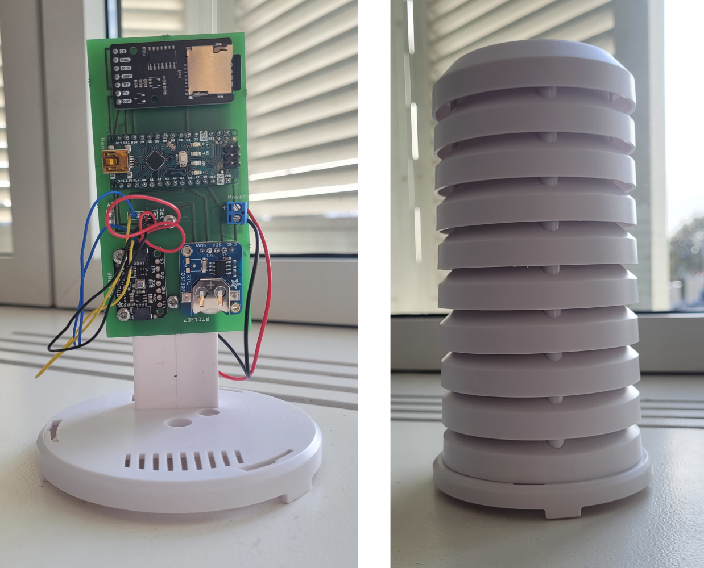

=====================================================================
LoggerMeteo: Une station météo autonome contrôlé par un Arduino Nano
=====================================================================

Principe
=========

LoggerMeteo est une station connectée à un datalogger autonome fonctionnant sur piles AA/AAA. Ses propriétés sont les suivantes

* l'enregistreur est contrôlé par un Arduino Nano, modifié dans le but de réduire la consommation d'énergie, tout en gardant l'instrument simple à manipuler et à programmer ;
* il enregistre la température, la pression, l'humidité et la teneur en gaz à l'aide d'un capteur Adafruit BME680 ;
* les données sont stockées sur un lecteur de carte SD uPesy ;
* le temps est enregistré par une horloge RTC1307 (toujours d'Adafruit)
* il peut-être emballé dans un "abri" météo TFA Dostmann

Tous les composants sont soudés sur une carte PCB conçue avec Fritzing.
L'enregistreur est facile à construire (il fait partie d'un cours d'étudiant de premier cycle), facile à utiliser (il suffit de retirer la carte SD de temps en temps pour charger les données qui sont écrites sur un fichier texte ascii), et est indépendant de tout réseau et logiciel propriétaire.

Avec un taux d'échantillonnage de 15 minutes, il fonctionne plus de cinq mois avec 3 piles AAA ou 11 mois avec 3 piles AA. Il est destiné à être déployé dans des endroits où la connexion est absente ou hasardeuse.

Coût
====
Le coût est donné pour les composants que j'utilise. Ils sont indicatifs et peuvent varier en fonction du fournisseur.

.. list-table:: 
  :header-rows: 1

  * - Composant
    - Prix (€ TTC)
  * - Arduino Nano
    - 25.90
  * - DS1307 RTC Clock (Ada 3296)
    - 9.8
  * - lecteur de cartes uPesy SD
    - 7.20
  * - Coupleur de piles
    - 2.00
  * - Carte PCB
    - 5.00
  * - Carte SD  (8Go)
    - 9.5
  * - Piles
    - 2.0
  * - Abri TFA Dostmann
    - 14.00
  * - **Total**
    - **75.4**

Liens
=====

* https://morpho.ipgp.fr/metivier/public/ScEd/build/html/Datalogger.html
* https://morpho.ipgp.fr/metivier/public/Howto/build/html/Arduino.html

Images
======

Dispositif avec Piles AAA
-------------------------

Breadboard 
----------

Le lecteur de carte est figuré par les emplacements des headers. Idem pour le BME680. Le BME est vissé. 
Sa connection se fait en soudant les quatres fils de la connexion I2C ce qui permet, si d'aventure le capteur lache, de le changer facilement.

Fritzing
--------

